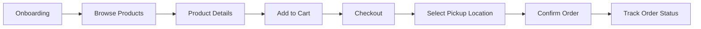
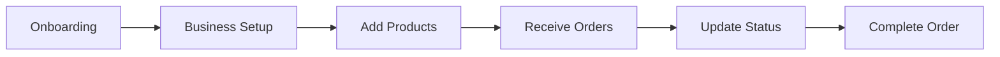

<p align="center">
  
</p>

<h1 align="center">🌱 FarmDashr</h1>

<p align="center">
  <b>Connecting Local Farmers with Conscious Customers</b>
</p>

<p align="center">
  
  
  
  
  
</p>

<p align="center">
  
</p>

---

## 📖 Overview

**FarmDashr** is a modern farm-to-table marketplace application that bridges the gap between local farmers and health-conscious customers. Built with Flutter for cross-platform support, it provides a seamless experience for both farmers to manage their products and customers to discover fresh, locally-sourced produce.

### 🎯 Mission

Empowering local agriculture by making farm-fresh products accessible to everyone while providing farmers with the tools they need to grow their business.

---

## ✨ Features

### 👨‍🌾 For Farmers

| Feature | Description |
|---------|-------------|
| **Product Management** | Add, edit, and manage product inventory with images, categories, and custom pickup locations |
| **Order Dashboard** | Real-time order tracking with status updates (Pending → Confirmed → Ready → Completed) |
| **Business Profile** | Showcase your farm with business hours, location, and custom pickup points |
| **Inventory Tracking** | Low stock alerts and automated inventory management |
| **Push Notifications** | Instant alerts for new orders and customer messages |
| **Analytics** | Track sales, revenue, and product performance |

### 🛒 For Customers

| Feature | Description |
|---------|-------------|
| **Browse Products** | Discover fresh produce with category filtering and search |
| **Nearby Farms Map** | Interactive map to find farms and pickup locations near you |
| **Shopping Cart** | Add items from multiple farmers and checkout seamlessly |
| **Pre-Order System** | Schedule pickups at your convenience |
| **Order Tracking** | Real-time status updates on your orders |
| **Vendor Profiles** | Learn about farms, their practices, and available products |

---

## 🛠️ Tech Stack

### Core Technologies

```
Flutter 3.10+          →  Cross-platform UI framework
Dart 3.10+             →  Programming language
Firebase               →  Backend-as-a-Service
```

### Architecture & State Management

```
BLoC Pattern           →  Predictable state management
GoRouter               →  Declarative routing with deep linking
Repository Pattern     →  Clean data layer abstraction
```

### Firebase Services

| Service | Purpose |
|---------|---------|
| **Authentication** | Email/password + Google Sign-In |
| **Cloud Firestore** | Real-time NoSQL database |
| **Cloud Messaging** | Push notifications |
| **Cloudinary** | Image storage and optimization |

### Key Dependencies

```yaml
flutter_bloc: ^9.1.1      # State management
go_router: ^17.0.1        # Navigation
cloud_firestore: ^6.1.1   # Database
firebase_auth: ^6.1.2     # Authentication
google_sign_in: ^6.2.1    # OAuth
flutter_map: ^7.0.2       # Interactive maps
geolocator: ^14.0.0       # Location services
cached_network_image      # Image caching
```

---

## 📁 Project Structure

```
lib/
├── blocs/                    # BLoC state management
│   ├── auth/                 # Authentication state
│   ├── cart/                 # Shopping cart state
│   ├── notification/         # Push notifications state
│   ├── order/                # Order management state
│   ├── product/              # Product catalog state
│   └── vendor/               # Vendor/farmer state
│
├── core/                     # Core utilities
│   ├── constants/            # Colors, dimensions, text styles
│   ├── services/             # Auth, Cloudinary, notifications
│   └── theme/                # App theming
│
├── data/                     # Data layer
│   ├── models/               # Data models (Product, Order, User, etc.)
│   └── repositories/         # Firestore repository implementations
│
├── pages/                    # UI screens
│   ├── common/               # Shared pages (profile, help, settings)
│   ├── customer/             # Customer-facing screens
│   └── farmer/               # Farmer-facing screens
│
├── presentation/             # Reusable widgets & components
│
├── main.dart                 # App entry point
└── router.dart               # Navigation configuration
```

---

## 🚀 Getting Started

### Prerequisites

- Flutter SDK 3.10+
- Dart 3.10+
- Firebase project configured
- Android Studio / VS Code

### Installation

1. **Clone the repository**
   ```bash
   git clone https://github.com/KyNe0328/farmdashr.git
   cd farmdashr
   ```

2. **Install dependencies**
   ```bash
   flutter pub get
   ```

3. **Configure Firebase**
   - Add your `google-services.json` (Android) 
   - Update `firebase_options.dart` with your config

4. **Run the app**
   ```bash
   flutter run
   ```

### Build for Production

```bash
# Android APK (split by ABI for smaller size)
flutter build apk --split-per-abi --obfuscate --split-debug-info=build/debug-info
```

---

## 🎨 Design System

FarmDashr features a cohesive design language with a nature-inspired color palette:

| Color | Hex | Usage |
|-------|-----|-------|
| 🟢 Primary | `#009966` | Main brand color, CTAs |
| 🌿 Success | `#009966` | Positive actions, confirmations |
| 🟡 Warning | `#F59E0B` | Alerts, low stock indicators |
| 🔴 Error | `#EF4444` | Errors, destructive actions |
| 🔵 Info | `#3B82F6` | Informational messages |
| 🌲 Farmer Theme | `#166534` | Farmer-specific UI accents |

### Typography

The app uses **Arimo**, a clean sans-serif font family with support for multiple weights (Regular, Medium, SemiBold, Bold) and italic variants.

---

## 📱 App Flows

### Customer Journey



### Farmer Journey



---

## 🔐 Security

- **Firebase Security Rules** for Firestore access control
- **Secure authentication** via Firebase Auth
- **Data validation** at both client and server levels
- **APK obfuscation** for release builds

---

## 📄 License

This project is proprietary software. All rights reserved.

---

<p align="center">
  <b>Made with 💚 for local farmers and conscious consumers</b>
</p>

<p align="center">
  <sub>© 2024-2026 FarmDashr. All rights reserved.</sub>
</p>
